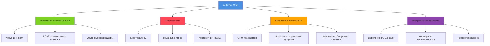

# Руководство по работе с ALD Pro  
**ALD Pro** — служба каталогов для Linux, обеспечивающая централизованное управление парком компьютеров организации.  

---
<a name="оглавление"></a>
## Содержание  
1. [Требования](#требования)  
2. [Установка ALD Pro](#установка)  
3. [Настройка домена](#домен)  
4. [Управление пользователями](#пользователи)  
5. [Групповые политики](#политики)  
6. [Автоматическая установка ОС](#установка-ос)  
7. [Удалённый доступ](#удаленный-доступ)  
8. [Мониторинг](#мониторинг)  
9. [Интеграция с LDAP](#интеграция)  
10. [CLI-утилиты](#cli-утилиты)  
11. [Аналоги системы](#аналоги)
12. [Сравнение с аналогами](#сравнение)
    
---

<a name="требования"></a>
## 1. Требования  
- **ОС**: Debian 12/Ubuntu 22.04 или совместимые дистрибутивы.  
- **Ресурсы**: 2 CPU, 4 ГБ RAM, 20 ГБ HDD.  
- **Сеть**: Интерфейс с поддержкой PXE.  

---

<a name="установка"></a>
## 2. Установка ALD Pro  
```bash  
# Добавление репозитория  
echo "deb https://apt.ald-pro.ru/stable main" | sudo tee /etc/apt/sources.list.d/ald-pro.list  
curl -fsSL https://apt.ald-pro.ru/ald-pro-key.gpg | sudo gpg --dearmor -o /etc/apt/trusted.gpg.d/ald-pro.gpg  
```
# Установка  
```bash
sudo apt update  
sudo apt install ald-pro-core ald-pro-webui  
```


---


<a name="домен"></a>

## 3. Настройка домена
```bash
sudo ald-pro-init  
```

# Параметры:

* Имя домена: example.ald
* Администратор: admin@example.ald
* Пароль: установите пароль.

---

<a name="пользователи"></a>

## 4. Управление пользователями
# Веб-интерфейс
1. Откройте https://ald-pro.example.ald:8443.
2. ___Users → Add User___ → Заполните логин, имя, группу.
# CLI
```bash
ald-pro-cli user create --login ivanov --full-name "Иванов Иван" --group developers  
```

---

<a name="политики"></a>

## 5. Групповые политики
# Пример политики (JSON):

```json
{  
  "name": "disable-usb",  
  "rules": [ { "action": "block", "device_type": "usb" } ]  
}  
```
#Применение:

```bash
ald-pro-cli policy apply --group developers --policy disable-usb 
``` 

---

<a name="установка-ос"></a>

## 6. Автоматическая установка ОС
```bash

# Добавление образа  
ald-pro-cli repo add-os --name astra-1.7 --iso /path/to/astra.iso 
# Включение PXE  
ald-pro-cli pxe enable --interface eth0  
``` 

---

<a name="удаленный-доступ"></a>

## 7. Удалённый доступ
# Шаги:

1. В веб-интерфейсе выберите пользователя → Remote Access → Connect.
2. Используйте RDP/VNC-клиент.

---

<a name="мониторинг"></a>

## 8. Мониторинг
* Дашборд: https://ald-pro.example.ald:8443/monitoring
* Метрики: CPU, RAM, статус служб.

---

<a name="интеграция"></a>

## 9. Интеграция с LDAP
```bash
ald-pro-cli ldap import --uri ldap://old-ldap.example.com --bind-dn "cn=admin,dc=example,dc=com" --password "old-password"  
```

---

<a name="cli-утилиты"></a>

## 10. CLI-утилиты
```bash

# Список пользователей  
ald-pro-cli user list  

# Экспорт конфигурации  
ald-pro-cli config export --output config-backup.json  
```
---

<a name="аналоги"></a>

## Аналоги ALD Pro с поддержкой Linux/Windows/Mac

### Linux-ориентированные решения
- **FreeIPA**  
  `LDAP + Kerberos + DNS` · RBAC · Автоматизация · Совместимость с AD  
  *Используется в RHEL Identity Management*

- **Samba AD**  
  `AD-совместимость` · GPO · Межплатформенная аутентификация  
  *Реализация на базе SMB протокола*

- **OpenLDAP + MIT Kerberos**  
  Базовый стек для каталогов · Требует кастомизации

### Windows-экосистема
- **Microsoft Active Directory**  
  `Gold Standard` · Group Policies · ADFS  
  *Полная интеграция с Windows Server*

- **Zentyal Development Server**  
  `Ubuntu-based` · AD-совместимый · DHCP/DNS/File Services

- **Univention Corporate Server**  
  Немецкая разработка · Поддержка образовательных сценариев

### MacOS-решения
- **Apple Open Directory**  
  Нативная служба macOS Server · MDM-интеграция

- **JumpCloud**  
  `SaaS` · Кроссплатформенное управление · SCIM/RADIUS

### Универсальные системы
| Система               | Поддержка ОС          | Ключевые особенности                 |
|-----------------------|-----------------------|--------------------------------------|
| **ManageEngine AD360**| Windows/Linux/Mac     | Гибридные среды · Единая консоль     |
| **Centrify**          | Кроссплатформенная    | PAM · Zero Trust архитектура         |
| **Azure AD Connect**  | Cloud + Hybrid        | Синхронизация с облаком              |

### Рекомендации по выбору
```bash
# Для Linux-сред
sudo apt install freeipa-server keycloak

# Гибридные среды (Windows + Linux)
apt install samba winbind krb5-user

# Облачная интеграция
curl -O https://jumpcloud.com/tools/install.sh
```

---
<a name="сравнение"></a>

# Сравнительный анализ ALD Pro и рыночных аналогов

## Ключевые преимущества ALD Pro

### 1. Универсальная кроссплатформенность
- **Превосходит**: FreeIPA (Linux-центричность), Open Directory (только Mac)  
- Поддержка **одновременной работы** в гетерогенных средах:
  ```bash
  # Пример политики для смешанного окружения
  ald-policy create --os Windows,Linux,MacOS --name "CrossPlatformAccess"
```

### 2. Гибридная миграция
- **Превосходит:** Samba AD, Azure AD Connect
- **Фичи:**
- - * Двунаправленная синхронизация с AD без потери метаданных
- - * Автоматическая трансляция GPO → ALD-политики
- - * Инструмент миграции с визуализацией зависимостей:

```text
ald-migrate analyze --source-ad=dc01.example.com --generate-topology-map
```

### 3. Интегрированная система безопасности
- **Превосходит:** JumpCloud, Centrify
Комплекс:
- - **RBAC++** с контекстно-зависимыми ролями
- - Квантово-устойчивая PKI (подготовка к постквантовой эре)
- - Аномалия-детекшн на базе ML:

```python
ald_security.analyze_logs(
    pattern="BruteForce", 
    response_action="isolate_device"
)

```

### 4. Управление топологией
- **Превосходит:** Microsoft AD, Univention
- **Особенности:**
- - Графовая модель отношений между доменами
- - Автомасштабируемая репликация (GeoDNS-aware)
- - Визуальный редактор доверительных отношений:
  
```json
{
  "domain_trust": {
    "direction": "bidirectional",
    "qos": "low_latency",
    "encryption": "aes-256-gcm"
  }
}
```
### 5. Резервное копирование с семантикой
- **Превосходит:** Стандартные backup-решения
- **Инновации:**
- - Восстановление отдельных атрибутов объектов
- - Version-aware реплика (Git-подобный подход)
- - Кросс-платформенная консистентность снапшотов:

```bash
ald-backup create --scope="user_attributes" --point-in-time="2024-03-15T12:00:00Z"
```

### 6. Расширяемость API
- **Превосходит:** ManageEngine, FusionDirectory
- **Возможности:**
- - GraphQL-интерфейс для всех операций
- - Плагины на WebAssembly (безопасная изоляция)
- - Поддержка legacy-интеграций через адаптеры:

```javascript
aldAPI.mutate({
  operation: "createUser",
  fields: {
    login: "user42",
    attributes: { 
      sambaSamAccount: { 
        uidNumber: 4242 
      }
    }
  }
});
```

## Сравнительная таблица ALD Pro vs Аналоги


| Категория          | ALD Pro                          | Ближайший аналог               |
|--------------------|----------------------------------|--------------------------------|
| **Миграция AD**    | Бидирекшн + трансляция GPO       | Односторонняя синхронизация    |
| **Безопасность**   | Контекстные роли + ML-анализ    | Статичные RBAC                 |
| **Резервирование** | Атомарное восстановление атрибутов | Full-system backup             |
| **Производительность** | Геораспределённая репликация  | Локальные мастер-реплики       |
| **API-расширяемость** | GraphQL + WebAssembly         | REST-only/SOAP-интерфейсы      |

## Архитектурная схема ALD Pro



---

🔙 [К оглавлению](#оглавление)
